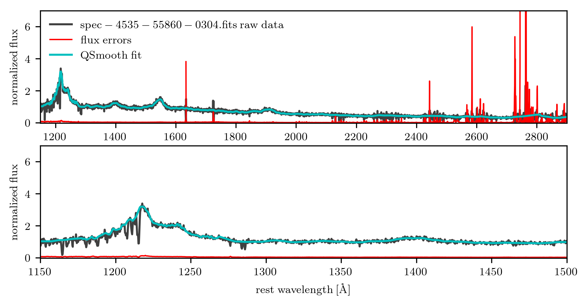

# QSANNdRA

This code was developed by Dominika Ďurovčíková and first implemented in [Ďurovčíková et al. 2019](https://arxiv.org/abs/1912.01050).

Please include the following citation if you use this code:

Ďurovčíková, D., Katz, H., Bosman, S.E.I., Davies, F.B., Devriendt, J. and Slyz, A., 2019.
Reionization history constraints from neural network based predictions of high-redshift quasar continua.
arXiv preprint arXiv:1912.01050.

## Description

### Preprocessing

### Building QSANNdRA

### Application to high-redshift quasars

## Contact

Please contact Dominika Ďurovčíková at dominika.durovcikova@gmail.com in case of questions/issues.
