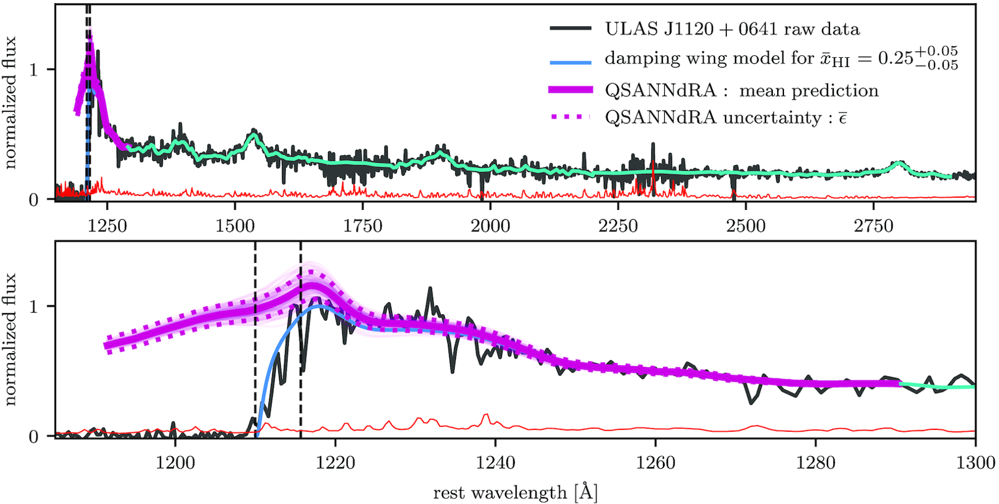

# QSANNdRA

This code was developed by Dominika Ďurovčíková and first implemented in [Ďurovčíková et al. 2020](https://academic.oup.com/mnras/article-abstract/493/3/4256/5741730?redirectedFrom=fulltext).

Please include the following citation if you use this code:

D. Ďurovčíková, H. Katz, S. E. I. Bosman, F. B. Davies, J. Devriendt, and A. Slyz, Monthly Notices of the Royal Astronomical Society 493, 4256 (2020).

## Description

### Preprocessing

To preprocess low-redshift training data, use script "example_preprocessing.py".

### Building QSANNdRA

To build and train QSANNdRA, use script "example_training.py".

### Application to high-redshift quasars

To preprocess high-redshift data, use script "example_high-z.py".

To apply QSANNdRA, use script "example_apply.py".

## Contact

Please contact Dominika Ďurovčíková at dominika.durovcikova@gmail.com in case of questions/issues.
